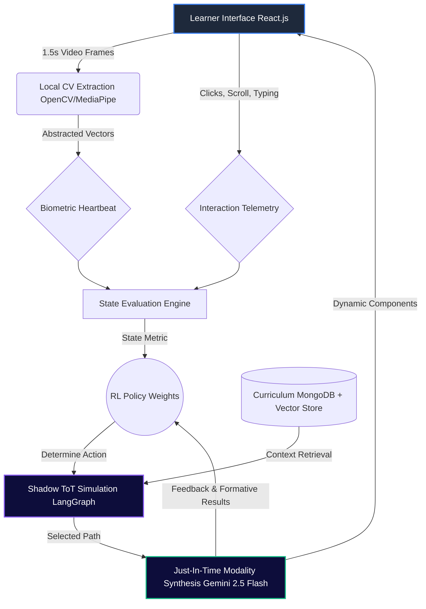

# Chapter 3: Methodology

## 3.1 Methodological Choices & Justification

This research employs a rigorous **Mixed-Methods approach**, systematically converging quantitative telemetry data with qualitative learner feedback. The quantitative dimension strictly monitors behavioral and biometric signatures during engagement with the system, establishing an objective baseline for cognitive state assessment. The qualitative dimension captures subjective user experience, ensuring that algorithmic adaptations align with perceived pedagogical efficacy. This dual-lens strategy mitigates the risk of optimizing for arbitrary technical metrics at the expense of genuine comprehension.

The architectural departure from traditional, linear Computer-Assisted Instruction (CAI) systems is actualized through the integration of **Reinforcement Learning (RL)** and **Tree-of-Thought (ToT)** frameworks for dynamic pedagogical branching. Traditional intelligent tutoring systems frequently rely on static, pre-defined decision trees that fail to accommodate the nuanced volatility of human learning. By utilizing RL, EduSynth continuously refines its instructional policy based on interaction outcomes. Concurrently, the ToT framework enables the system to proactively model multiple pedagogical trajectory hypotheses, evaluate their probable efficacy based on the learner's current state, and select the optimal branching pathway. 

These technical implementations are deeply anchored in established educational psychology paradigms, specifically **Cognitive Load Theory** and **Scaffolding**. The system continuously modulates the complexity and modality of delivered content to maintain the learner's cognitive load within the optimal theoretical window—preventing both cognitive overload and under-stimulation. Scaffolding is dynamically assembled and disassembled; the system detects moments of high cognitive friction and immediately injects appropriate structural support, which is systematically faded as mastery is demonstrated.

## 3.2 Data Collection & Sources

Data acquisition operates through a robust, high-frequency synchronization architecture designed to capture a holistic representation of the learner's state. 

The primary sensory input is the **1.5s 'Biometric Heartbeat'**, a continuous stream of physiological and behavioral indicators acquired via the device's camera. Utilizing Computer Vision (CV), the system processes and classifies Emotion, Gaze tracking, and Posture alignment every 1.5 seconds. This micro-temporal resolution provides a granular, real-time map of attentional drift and emotional valence (e.g., frustration, boredom, flow).

Simultaneously, the system processes **Interaction Telemetry**. This involves tracking the physical interaction dynamics, including *Velocity* (the speed of scrolling, typing, and task completion), *Persistence* (time spent engaging with high-friction problem sets before requesting hints), and *Modality Bias* (the learner's implicit preference for text, audio, or visual data representations).

To ground the pedagogical adaptations in domain-specific knowledge, the system utilizes **RAG-driven Contextual Injection**. Educational materials—user-uploaded PDF modules, semantic graphs, and syllabi—are vectorized and processed through Retrieval-Augmented Generation (RAG). This ensures that the system's generated interventions remain contextually bounded and strictly relevant to the intended curriculum.

## 3.3 Data Analysis & AI Core Logic

The core intelligence of EduSynth is mediated by a real-time analytical pipeline that dictates systemic adaptation.

The central mechanism of adaptation is the dynamic **'Reward Function' calculation**, which is utilized to update RL policy weights in real-time. The reward function is fundamentally non-stationery; it calculates a composite score derived from an increase in comprehension (measured via periodic formative assessment accuracy) juxtaposed against improvements in the Biometric Heartbeat metrics (e.g., reduced classification of frustration, maintained visual focus). Successful interventions positively reinforce the specific pedagogical strategy, altering subsequent decision probabilities.

Crucially, before deploying an intervention, EduSynth executes a **'Shadow ToT' simulation**. When a divergence in the learning path is detected as necessary, the system generates a localized Tree-of-Thought, propagating multiple instructional paths (e.g., offering a visual analogy vs. requesting the student to explain the concept back). The system evaluates these simulated paths against the historical interaction state, pruning suboptimal branches and executing only the pathway with the highest probabilistic alignment to the current user state.

Once the optimal pedagogical action is determined, the content is realized via a **'Just-In-Time' (JIT) synthesis process**. Content is not retrieved from a static database; rather, the underlying informational components are assembled, reformatted, and contextually styled instantaneously by the LLM, ensuring the delivery modality perfectly matches the RL agent's prescription.

## 3.4 Tools & Materials

The implementation of EduSynth relies on a highly integrated, modern technical stack optimized for low-latency multimodal processing:

*   **Backend & Orchestration:** Python, utilizing the FastAPI framework for high-throughput asynchronous API endpoints, combined with LangGraph to orchestrate the complex, multi-agent ToT workflows and manage cyclic agent state.
*   **Frontend Interface:** React.js, deployed to construct a highly responsive, glassmorphism-styled UI capable of rendering dynamic, multimodal components in real-time.
*   **Database Integration:** MongoDB operates as the primary unstructured data store, managing complex, serialized agent states and extensive user interaction telemetry securely.
*   **AI Inference Engine:** Vertex AI powers the core intelligence, specifically leveraging the Gemini 2.5 Flash model for hyper-fast multimodal reasoning, JIT synthesis, and vision data interpretation.
*   **Biometric Processing:** OpenCV and MediaPipe provide the foundational libraries for the local extraction of posture and gaze vectors prior to processing.

Research materials driving the RAG architecture consist of standardized higher-education curriculum data, encompassing peer-reviewed textbooks, accredited course syllabi, and rigorously validated formative assessment batteries across STEM disciplines.

## 3.5 Bias Mitigation & Ethics

Deploying high-frequency, multimodal surveillance in an educational context necessitates uncompromising ethical constraints. 

First and foremost, the system operates on a doctrine of **'Privacy-by-Design'**. The CV processing pipeline executes feature extraction natively within volatile memory. At no point does the system record, transmit, or store raw video feeds or identifiable imagery. Only the abstracted coordinate vectors and classified emotional state identifiers (the "Biometric Heartbeat") are transmitted to the backend for analysis, ensuring total anonymity of the raw visual data.

To combat algorithmic opacity, the system incorporates robust **'Explainable AI' (XAI) features** materialized through an 'Agent Debugger' interface. This allows educators and researchers to pause the system state and audit the explicit reasoning chain—the Shadow ToT evaluations—that led to a specific pedagogical intervention, effectively mitigating the "black box" phenomenon typical of complex ML frameworks.

Finally, the JIT synthesis module operates with strict **'Diversity-Aware Prompting'**. System prompts are rigidly engineered to bypass inherent biases in foundational models, ensuring that generated examples, cultural references, and instructional analogies remain subject-neutral, globally applicable, and strictly devoid of demographic assumptions.

## 3.6 Results Visualization & Diagrams

System efficacy is monitored through two primary, newly defined Key Performance Indicators (KPIs):
1.  **Engagement Stability Index (ESI):** A composite metric quantifying the duration the learner remains within the optimal biometric and interaction boundaries before requiring systemic intervention.
2.  **Modality Adaptation Speed (MAS):** The latency between the system detecting a threshold breach in cognitive load and the successful deployment of a correctly modality-shifted pedagogical intervention.

### Interaction Mapping Policy

The following table details the primary mapping logic utilized by the RL policy to determine multimodal actions based on synthesized interaction states:

| Interaction State (CV + Telemetry) | Identified Cognitive State | RL Policy Action (Node Selection) | JIT Multimodal Action |
| :--- | :--- | :--- | :--- |
| High Frustration (CV) + High Persistence | Cognitive Overload | Scaffold Degradation | Synthesize visual diagram (Mermaid.js); Reduce text verbosity. |
| Gaze Drift (CV) + Low Velocity | Attentional Decay / Boredom | Interactive Branching | Deploy active-recall micro-quiz; Shift to interactive Socratic dialogue. |
| Neutral Emotion (CV) + High Velocity | Optimal Flow State | Complexity Escalation | Inject advanced corollary concepts; Increase problem set difficulty. |
| Confusion (CV) + Modality Bias (Text) | Modality Mismatch | Semantic Reframing | Replace current text with simplified, real-world analogy paragraph. |

### System Architecture Diagram

